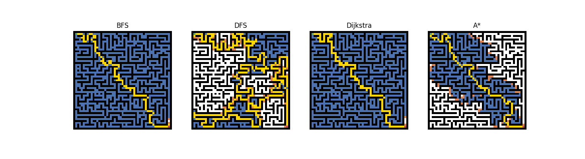

# Graph Search Algorithms Visualization

This program animates and visualizes four graph search algorithms: BFS, DFS, Dijkstra, and A*.

## Description

The program generates a maze and runs each algorithm to find the path from start to goal, animating the search process side by side for comparison.

## Results

## Requirements

- Python 3
- matplotlib
- numpy